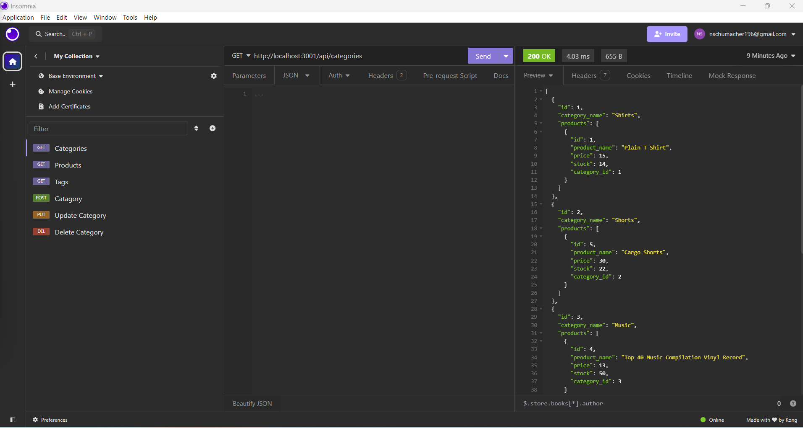

# E-commerce-Back-End

## Description

This was a project to build the back end for an e-commerce site using express.js and Sequelize. This application does not have a front end. I am using Insomnia to see and update the data. The application works with categories, products and tags. The user can GET, POST, PUT, and DELETE for each respective bucket. 

## Installation and Setup

Clone the repository to your local machine. npm install, npm run seed, then npm run dev to test data is being sent and stored properly, we suggest using Insomnia to test routes.

## License

MIT (https://choosealicense.com/licenses/mit/)

## Status & Future Development

I would like to finish out this project by adding a front end UI.

Video walk through: https://drive.google.com/file/d/1ontdreRdBss-wpNry0lUmDAqyEVr4k8l/view

GitHub Repo: https://github.com/NicoleBrubaker/E-commerce-Back-End

Working app: 

